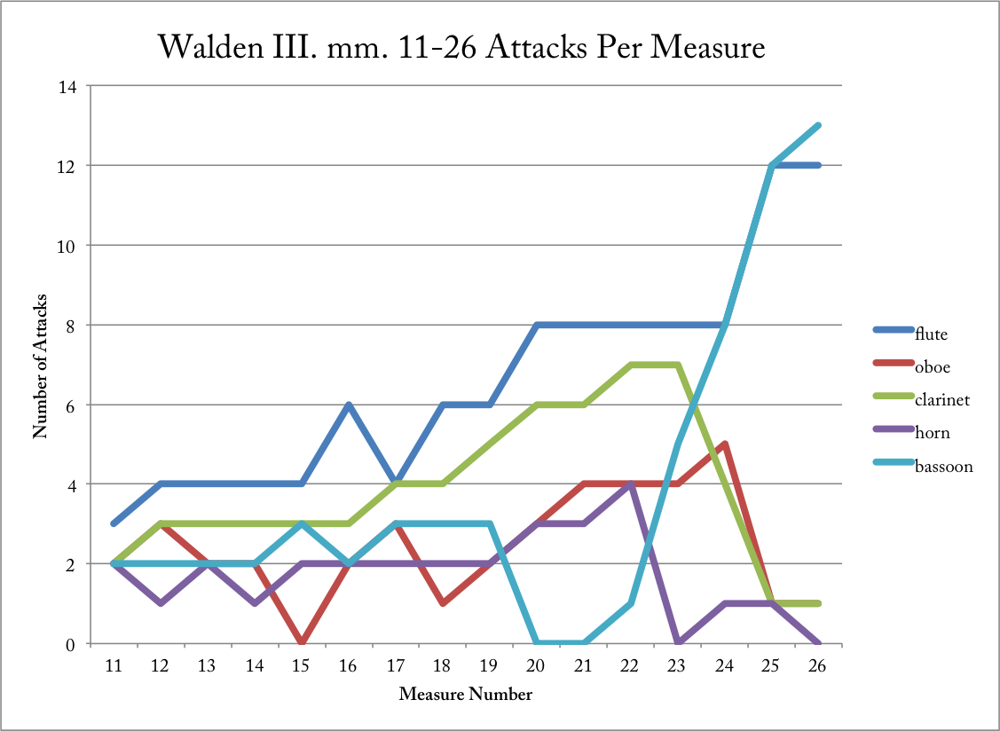

# Front Matter

- Biographical Sketch
- Acknowledgements
- Abstract
- Table of Contents
- List of Figures
- List of Tables

# Introduction

- Abrahamsen's career

  - 1970s-1988: first period

    - characteristics of music
    - New simplicity
    - *Ten Preludes* as an example

  - 1988-1999: pause

    - arrangements and reorchestrations

  - 1999-present: second period ("post-fermata")

    - new technical innovations

- Discussion of reusing ideas from earlier works in *Flowersongs* (1973) program note:

  > I cannot help but carry with me to this day the ideas from my early works. For example, there are clear links in this work from the 8th Prelude from *10 Preludes* and to *Canon 2a* from *Schnee* from 2008\. This work is written for the wonderful ensemble recherche and it was meeting them that made me consider making a version of *Flowersongs* for flute, oboe and clarinet.

- Discussion of reusing ideas from earlier works in *Ten Sinfonias* (2010) program note:

  > Over the years I have found a way of working where I again and again return to my previous works and sketches to see if there are hidden opportunities and ways as I did not see then or for that matter, could develop into new works.

  > A work which I often return to is my *String Quartet No. 1* subtitled *10 Preludes* from the spring 1973\. This piece is in many ways a key work from my early period. It consists of ten short pieces -- or maybe beginnings written in a new simplistic (or minimalistic) and poly-stylistical style.

  > ...

  > I feel myself in family with composers who again and again re-work their pieces from one version to another – say Ravel or Stravinsky. The latter re-thought in 1962, the small simple piano pieces *Les Cinq Doigts* from 1921 for a small orchestra titled *Eight Instrumental Miniatures*. This is just one example. One could go on to mention how Stravinsky transforms and re-thinks his own to say noting about works of other composers.

# Part One: Historical Context

## Intertexuality/intermusicality?

- Mikhail Bakhtin and *The Dialogic Imagination* (from Wikipedia: <https://en.wikipedia.org/wiki/Dialogic>):

> Bakhtin contrasts the dialogic and the "monologic" work of literature. The dialogic work carries on a continual dialogue with other works of literature and other authors. It does not merely answer, correct, silence, or extend a previous work, but informs and is continually informed by the previous work. Dialogic literature is in communication with multiple works. This is not merely a matter of influence, for the dialogue extends in both directions, and the previous work of literature is as altered by the dialogue as the present one is. Though Bakhtin's "dialogic" emanates from his work with colleagues in what we now call the "Bakhtin Circle" in years following 1918, his work was not known to the West or translated into English until the 1970s. For those only recently introduced to Bakhtin's ideas but familiar with T. S. Eliot, his "dialogic" is consonant with Eliot's ideas in "Tradition and the Individual Talent," where Eliot holds that "the past should be altered by the present as much as the present is directed by the past".[1] For Bakhtin, the influence can also occur at the level of the individual word or phrase as much as it does the work and even the oeuvre or collection of works. A German cannot use the word "fatherland" or the phrase "blood and soil" without (possibly unintentionally) also echoing (or, Bakhtin would say "refracting") the meaning that those terms took on under Nazism. Every word has a history of usage to which it responds, and anticipates a future response.

> The term 'dialogic' does not only apply to literature. For Bakhtin, all language -- indeed, all thought -- appears as dialogical. This means that everything anybody ever says always exists in response to things that have been said before and in anticipation of things that will be said in response. In other words, we do not speak in a vacuum. All language (and the ideas which language contains and communicates) is dynamic, relational and engaged in a process of endless redescriptions of the world.

> Bakhtin also emphasized certain uses of language that maximized the dialogic nature of words, and other uses that attempted to limit or restrict their polyvocality. At one extreme is novelistic discourse, particularly that of a Dostoevsky (or Mark Twain) in which various registers and languages are allowed to interact and respond to each other. At the other extreme would be the military order (or "1984" newspeak) which attempts to minimize all orientations of the work toward the past or the future, and which prompts no response but obedience.

> When scholars, like Julia Kristeva, in the late 1970s and early 1980s, rediscovered Bakhtin, his work seemed to fit with the then-nascent concepts of "intertextuality". And European social psychologists applied Bakhtin's work to the study of human social experience, preferring it as a more dynamic alternative to Cartesian monologicality.

- R. F. Thomas, "Virgil's *Georgics* and the art of reference" *Harvard Studies in Classical Philology* 90 (1986) pp 171–98.
- In discussing the richly allusive poetry of Virgil's *Georgics*, R. F. Thomas distinguished six categories of allusive reference, which are applicable to a wider cultural sphere. These types are:

  1. **Casual Reference**, "the use of language which recalls a specific antecedent, but only in a general sense" that is relatively unimportant to the new context;
  2. **Single Reference**, in which the hearer or reader is intended to "recall the context of the model and apply that context to the new situation"; such a specific single reference in Virgil, according to Thomas, is a means of "making connections or conveying ideas on a level of intense subtlety";
  3. **Self-Reference**, where the locus is in the poet's own work;
  4. **Corrective Allusion, where the imitation is clearly in opposition to the original source's intentions;
  5. **Apparent Reference** "which seems clearly to recall a specific model but which on closer inspection frustrates that intention"; and
  6. **Multiple Reference or Conflation**, which refers in various ways simultaneously to several sources, fusing and transforming the cultural traditions.

## Historical reworkings

- Parody music?
- From Wikipedia on parody: "During the Renaissance, a prevailing view of the balance between originality and homage to earlier artists was summed up by Sir Philip Sidney in his Defence of Poesy as "Art, Imitation and Exercise". Art, one's personal skills and talents, was expected to follow Imitation, the life or works of great predecessors, and the two must combine in Exercise, the synthesis of Art and Imitation."

## Composers who have had crises/taken breaks:

- Arnold Schoenberg
- Franco Donatoni

  - seven year cycles/crises
  - influence of Cage: trying to purge the influence, "He almost wrecked my life" (*Composer to composer*, pg. 118)
  - transitional pieces:

    - *Etwas ruhiger...* and connection to Schoenberg
    - *Ash* after the 2-year 1974 crisis: marks "the beginning of his current musical style (written in 1991)" (pg. 119)

      - became "freer"
      - "shift away from the earlier automatism; I invent more." (pg. 119)

  - needing a fragment (from *Composer to Composer*):

  > "Now I always use a fragment given to me, or the gragment of another score. I need a fragment. Something that can evelop organically. And then I can go. I have no predetermined idea of the form. The form emerges. The *sense* of form emerges."

## Composers that frequently rework older material:

- From *Concerto for Piano and Orchestra* program note:

> Characteristically for Hans Abrahamsen's works, one can dig out layer upon layer of earlier pieces from below the surface of the piano concerto. But there are also hidden allusions, as well as obvious references, to the music of other composers. This is clearest in the second movement, where one finds an explicit reference to Mahler - '(Wie Mahler!)' - at a point where the trumpet, fanfare-like, repeats the note C sharp. The third movement has a similar tribute to György Ligeti, who along with Per Nørgård and Pelle Gudmundsen-Holmgreen has been among Hans Abrahamsen's most important teachers.

- Luciano Berio
- Toru Takemitsu
- Toshio Hosokawa
- Pierre Boulez
- Franco Donatoni

- Possibly mention historical pieces arranged from smaller works:

  - Pictures at an Exhibition (suite of 10 piano pieces, like A's Ten Studies)

# Part Two: An Analysis of *Walden*

## Importance of horn to Abrahamsen

- principle instrument
- physicality of horn and his cerebral palsy (mentioned in left alone program note and NY Times article)
- other works featuring the horn:

  - *Six Pieces*: companion piece to Danish premiere of Ligeti's *Horn Trio*, reworks *Ten Studies*
  - *Left, alone* Part 2: IV. Horn and piano solo in orchestral context perhaps reminiscent of earliest work for horn and piano
  - *October*: first piece for horn and piano
  - *Left, alone* program note discusses:

  > I was born with a right hand that is not fully functional, and though it never prevented me from loving playing the piano as well as I could with this physical limitation, it has obviously given me an alternative focus on the whole piano literature and has given me a close relationship with the works written for the left hand by Ravel and others. This repertoire has been with me since my youth.

  > My very first public performance of one of my own works was in autumn 1969\. The piece was called *October* and I played the piano with my left hand and the horn, my principal instrument (the only instrument that can be played with only the left hand). Part of the piece requires the performer to play natural harmonics of the horn directly into the open strings of the grand piano to create resonance. The pedal was kept down by an assistant lying on the floor.

  > Through decades the idea of writing a larger work for piano left hand has been in my mind. This new work is not written for a pianist with only one hand, but rather by a composer who can only play with the left hand. The title *Left, alone* contains all kinds of references, not only to the obvious fact that the left hand is playing alone. *Left, alone* is divided into two large parts, each consisting of three smaller movements – in effect, six in total.

- connection to German romanticism

- connection to Schumann's *Waldenszen*

- discuss "Waldhorn" (from program note) and natural horn/microtonality

- connection to hunting:

  - from Cheung Dissertation: Raymond Monelle explains, "The medieval hunting horn was primarily a signaling instrument. During the course of personnel and hounds could become dispersed over wide area, and it was often necessary to communicate certain water, the release sight of the quarry, the loss of the scent, the plunging of the quarry into probable route of of (relais, small teams of huntsmen and hounds posted along the the hunt), the stag at bay, the stag and many other important steps in the process of hunting needed to be broadcast to the various members of the hunting party. The sound of the horns was also found to stimulate the hounds." Mondelle, Raymond. *The Musical Topic: Hunt, Military and Pastoral*. Bloomington, IN: Indiana University Press, 2006.

## Background

- Abrahamsen on title and Thoreau's book (Kullberg, 1985):

> Hm! .. It is no more literary than that it is a title I found out after I had written the piece. So I rediscovered some qualities in my music, as Thoreau had tried to write about in his book "Walden, life in the forest '- that was why I chose the title. So, one can say anything about recycling and something about the cyclical and something about the ecological and poetic dimension etc. - And I liked the title 'Walden', it is something with forest, some pastoral.

- Abrahamsen has indicated this in the program note for *Ten Studies*:

> The language of the title means a lot to me and to which associations it arouses the listener. there may, for instance, be a world of difference between a "Traumlied", a "Drømmesang" and a "Dream Song", for that matter.

> It is true about many of the titles that they have only been found after the pieces had been written; ie, I did not decide to write a boogie-woogie, but the title came as an afterthought at the end of the piece.

- instrumentation and reorchestration

- inspiration and relationship to nature

  - Abrahamsen's interesting mention of concretism, which is connected to the art movement that seems to eschew references to natures in favor of abstraction
  - <https://en.wikipedia.org/wiki/Concrete_art>
  - <https://en.wikipedia.org/wiki/De_Stijl>

- **questions**

  - date and place of premiere
  - date and place of reed quintet version premiere
  - considerations when translating the arrangement
  - adjustments made between the two versions

## Form

- basic info

  - four movements, untitled
  - decreasing durations

    - make it clear A thinks about ratios like this; it's in the Kullberg article explicitly

- differences between 1978 and 1995 version

  - I:

    - D major chord has more orchestration of horn's sustain
    - D major chord for trio instead of tutti

  - II:

    - written in 4/8 instead of 4/4

  - III:

  - IV:

    - written in 12/16 and 3/4

- description of movements

  - first movement

    - tonal ambiguity to tonal clarity
    - heterophony to homophony
    - independence to subsets (duos and trios)
    - strict processes:

      - rhythmic displacement
      - rhythmic subdivisions
      - prolation canons at a ratio of 1:2:4
      - retrograde in pitch
      - limited intervallic sets
      - permutational voice leading

  - second movement

    - cycles and symmetry
    - clarity in phrasing
    - compression of oboe phrases
    - strict processes:

      - rhythmic subdivisions
      - retrograde in pitch and rhythm
      - filtering out of motives

  - third movement

  - fourth movement

## Process and Techniques

**need to revise this section in order to only focus on the re-working of materials between I and II**

**still talk about III and IV but in the context of other aspects or not deep analytical detail**

1. rhythmic displacement and subdivision

  - I: mm. 1-16 horn call and response
  - III: mm. 5-7 two motive repetitions in ob, cl, and bsn

    - oboe shifts left by 1 quintuplet 16th
    - clarinet shifts right by 1 sixteenth
    - another way of saying this is the pattern is such a length that displacement happens due to meter

2. augmentation, diminution, canon, retrograde

  - I: mm. 21-38 and mm. 42-56 prolation canons
  - II: mm. 1-9 re-reading of I melody (mm. 57-61) and retrograde in pitch/rhythm

    - I mm. 57-61 melody stops right at point of retrograde

  - II: mm. 5-26 oboe melody and diminution/expansion of phrase length

    - process of filtering in both oboe melody and fl/bsn duo

  - III: mm. 1-10 ritarando/augmentation and mm. 10-25 accelerando/diminution and mm. 25-32 ritardando/augmentation
  - The final third passage of augmentation and diminution comes from measures 1-26 in the third movement. This passage can be divided into two sections, an augmentation of rhythmic values from measures 1-10 and then a diminution of rhythms from measures 10-26. Abrahamsen constructs both sections from polyrhythmic textures where individual voices change in rhythmic subdivision to accelerate or decelerate their repeated patterns. For instance, the opening of the movement features the flute, clarinet, and bassoon playing a polyrhythm of 10:7:4 (quintuplet thirty-seconds, over septuplet sixteenths, over sixteenths) that slows twice, once in measure 5 to a polyrhythm of 8:5 (for flute and horn) and again to 6:3 at measure 8 (for flute and clarinet). The process reverses from mm. 10-26, this time engaging the entire ensemble in the slow and deliberate acceleration to an interlocking angular sixteenth-note texture. One way to measure the increasing energy produced by this section is to track the number of articulations or attacks per measures. Figure @fig:walden-III-mm11-26-attacks plots each instrument's number of attacks from measures 11-26.
  - {#fig:walden-III-mm11-26-attacks width=65%}
  - This graph expresses the overall increase in the number of events over the course of this passage, and also illustrates how the flute and bassoon are the primary driving instruments at the end while the other three instruments change to long held notes.
  - **something on why this is useful**

3. harmony:

  - harmonic sets

    - [013], [014589], D major
    - limited intervallic motion

      - new intervals highlight change in section

    - syntax: changes in harmonic set at the end of a phrase/section

      - I: mm. 18-20 oboe entrance
      - I: mm. 38-41 B-D dyad and C-Eb dyad
      - II: mm. 28-30 new harmonic area (but related to earlier oboe line) to conclude mvmt
      - III: mm. 10 perfect fifth and beginning of new section

  - [013]

    - I: mm. 21-38 and mm. 42-56 are inversions of [013] around F#
    - I: mm. 38-39 contrast with major 3rd interval signal
    - II: same melody as in I
    - III:

  - D major

    - often functions as the ending harmonic area: I, II, and IV primarily
    - I: mm. 62-end
    - II: mm. 26
    - III: mm. 11-26 D major intersects with [014589] and mm. 27-end triadic horn call
    - IV: modulation to D major by end

  - [014589] and connection to parts of sets

4. polymeter and tempo:

  - I, II, and III: importance of rhythmic subdivisions; way of using polymeter to create different layers
  - IV: actually polymetric and polytempo

## Cross relationships between movements

- I:

  - perfect fourth motive and displacement
  - limited melodic motives

- II:

  - picking up where the first left off after the punctuated interruption
  - oboe F# C# at mm. 5-6, 15-16, and 24-25

- III:

  - oboe F# C# at climax, mm. 26-27
  - punctuated gesture towards end

- IV:

  - most unrelated; scalar material suggestive of scalar motion in first and second movements
  - polymeter and various subsets

## Connections to Other Music

- *Winternacht*

  - musical material

    - punctuated gestures
    - horn call at end of third mvmt close to *Winternacht*'s first and fourth mvmts

      - same articulation and triadic material

    - polyrhythmic acceleration and deceleartion (WN II vs Walden II)

  - formal similarity

    - material returning in another movement
    - movement picking up where the last left off (can't remember why I said this??)

- *Ten Preludes* and *Flowersongs*: ending with a clearly neo-classical movement

- *Wald*: prepare next section

# Part Three: An Analysis of *Wald*

## Background and instrumentation

- co-commission
- world premieres
- "subtle rhetoric": Julian Anderson on Abrahamsen's music; description of *Wald* and *Schnee*
- instrumentation and use of bass instruments:

  - scordatura harp
  - double horn in f/Bb?
  - bass trumpet played by the trombone player

- seating plan introduction

- **questions**

  - any changes made between two performances?

## Form

- series of variations
- tempo modulations

## Spatial layout

- connection to call and response
- connection to orchestration

## Introduction, Variation 1, and Variation 2

### Section 1

- Main features

  - highly organized proportions
  - rhythmic displacement
  - microtonal temperaments
  - symmetrical groups call and response by phrase
  - repeats in intro

- Musical elements

  1. quartal chord repeated twice
  2. repeated static notes (almost tremolo)
  3. perfect fourth call
  4. repeated note response: 1) horn, bass, harp and 2) bass flute, cello, kalimba

### Section 2

- Main features

  - highly organized proportions
  - rhythmic displacement
  - microtonal temperaments
  - chromatic harmonies `<123678>`
  - symmetrical groups call and response by phrase
  - repeats in intro

- Musical elements

  1. staccato quartal/chromatic chord repeated twice
  2. chromatic tremolo
  3. perfect fourth call
  4. chromatic line response

### Section 3

### Section 4

- Cascading material in marimba/harp and piano LH/RH
- Harmonies based on interval cycles and "woven" interlocking voices of the pentatonic 5-34[02469] material from Section 3
- Consists of four phrases:

  1. 10/16: marimba and harp in sixteenths
  2. 3/4: piano RH and LH in triplet sixteenths
  3. 6/16: marimba and harp in sixteenths
  4. 3/8: piano RH and LH in thirty-seconds

#### Introduction

- Phrase 1:

  - marimba: contour up; 5-cycle, 1-cycle,
  - harp: contour down; 1-cycle, 5-cycle, 6-cycle
  - upper voice: 5-34[02469] `<2579e>`
  - lower voice: 5-34[02469] `<58t02>`
  - related by T~3~

- Phrase 2:

  - piano RH: contour down; 5-cycle `<3816e412e482ee828e>`
  - piano LH: contour up; 1-cycle `<0et987e58755825552>`
  - four interwoven sets related by T~3~:

    1. soprano voice: 4-22[0247] `<8e13>`
    2. alto voice: 5-34[02469] `<e2468>`
    3. tenor voice: 5-34[02469] `<2579e>`
    4. bass voice: 4-22[0247] `<58t0>`

- Phrase 3:

  - marimba: contour down; 3- 4- and 5-cycle
  - harp: contour up; 3- 4- and 5-cycle
  - four interwoven sets related by T~3~:

    1. soprano voice: 4-22[0247] `<8e13>`
    2. alto voice: 3-7[025] `<e24>`
    3. tenor voice: 3-7[025] `<257>`
    4. bass voice: 4-22[0247] `<58t0>`

- Phrase 4:

  - piano RH: contour down; 5-cycle
  - piano LH: contour up; kind of 1-cycle
  - four interwoven sets (T~0~I T~3~I T~6~I T~7~I T~9~I T~10~I):

    1. RH soprano voice: 4-22[0247] `<8e13>` harmonized in fifths `<368t>`
    2. RH alto voice: 5-34[02469] `<e2468>`
    3. RH tenor voice: 3-7[025] `<8e1>`
    4. RH bass voice: 3-7[025] `<e24>`
    5. LH soprano: 5-34[02469] `<2579e>`
    6. LH alto: 3-7[025] `<357>`
    7. LH tenor: 3-7[025] `<58t>`
    8. LH bass: 3-7[025] `<58t>`

#### Variation 1

- Phrase 1:

  - marimba: contour down; 1-cycle, 5-cycle, 6-cycle
  - harp: contour up; 5-cycle, 1-cycle, 6-cycle
  - upper voice: 5-34[02469] `<368t0>`
  - lower voice: 5-34[02469] `<69e13>`
  - related by T~3~

- Phrase 2:

  - wider spaced dyads

    - they carry over the 1-cycle and 5-cycle voice leading from the first phrase
    - E and F# are like upper neighbors to the "in-key" F and G that follow them
    - also begin a kind of 2-cycle pattern
    - `<14><36>`

  - piano RH: 4-22[0247] `<0357>`
  - piano LH: 4-22[0247] `<368t>`
  - related by T~3~

- Phrase 3:

  - marimba: contour up; 3- 4- and 5-cycle
  - harp: contour down; 3- 4- and 5-cycle
  - upper voice: 4-22[0247] `<0357>`
  - lower voice: 4-22[0247] `<368t>`
  - related by T~3~
  - every 9 notes, there is a "out of key" dyad

    - `<e2><14><36>`
    - extends the 2-cycle pattern initiated in phrase 1

- Phrase 4:

  - four separate threads:

    1. soprano voice: 2-cycle in perfect fifths; lower = `<0246>`, upper = `<79e1>`
    2. alto voice: same as phrase 2 and 3; 4-22[0247] `<0357>`
    3. tenor voice: same as phrase 2 and 3; `<368t>`
    4. bass voice: 2-cycle `<9e13>`

#### Variation 2

- Phrase 1:
- Phrase 2:
- Phrase 3:
- Phrase 4:

## Variation 3 and Variation 4

## Variation 5

- More interval cycles: 5-cycle and 6-cycle
- Two primary motives:

  - ascending repeated figures voiced in fifths
  - descending dyads of tritones, fourths, and

## Variation 6 and Variation 7

## Connections to other music (good place for this discussion?)

- *Diabelli Variations* and connection to "sudden awakening" instruction at Variation 5

  - I think Abrahamsen is talking about *Diabelli Variation* No. 20

- *Winternacht* and connection to Beethoven's *Moonlight Sonata* (from Ernste)

- *Schnee* and connection to Bach canons and *Contrapunctus* (from discussion of Abrahamsen, **need to find source**)

  - Concept of doubling (both in orchestration and re-use)
  - Shrinking movement proportions

- *Wald* and connection to Schumann's *Waldenszen* (from program note and hopefully more from **Abrahamsen**)

# Conclusion

# Misc thoughts

Simplicity of A's music: Pierre Boulez interview with Andrew Ford (*Composer to Composer*, pg. 23):

> Take *Notations*, for example: In these short pieces the design is very clear. But if you go inside, you know, you find so many small relationships, the kitting of each element is so tight that it takes quite a lot of time to see what is really there. For me it is a game of appearance and reality.
