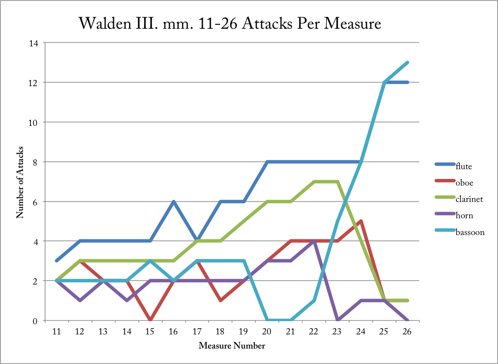

## Differences Between 1978 and 1995 Version

- I: D major chord has more orchestration of horn's sustain
- I: D major chord for trio instead of tutti
- II: written in 4/8 instead of 4/4
- II: second grand pause at mm. 54 in 1995 version
- III: accelerando portion, mm. 22 bassoon entrance is early and already arpeggiated
- IV: written in 12/16 and 3/4

## Form

- basic info

    - four movements, untitled
    - little interpretative markings
    - tempo markings in 1995 version
    - focus on structure in compositional process (Kullberg)
    - decreasing durations
    - number of sections decreases each movement

- description of movements

    - first movement

        - tonal ambiguity to tonal clarity
        - heterophony to homophony
        - independence to subsets (duos and trios)
        - strict processes:

            - rhythmic displacement
            - rhythmic subdivisions
            - prolation canons at a ratio of 1:2:4
            - retrograde in pitch
            - limited intervallic sets
            - permutational voice leading

    - second movement

        - cycles and symmetry
        - clarity in phrasing
        - compression of oboe phrases
        - strict processes:

            - rhythmic subdivisions
            - retrograde in pitch and rhythm
            - filtering out of motives

    - third movement
	
		- mechanical processes

    - fourth movement
		
		- neo-classical
		- polyrhythmic layers

## Process and Techniques

**need to revise this section in order to only focus on the re-working of materials between I and II**

**still talk about III and IV but in the context of other aspects or not deep analytical detail**

1. rhythmic displacement and subdivision

    - I: mm. 1-16 horn call and response
    - III: mm. 5-7 two motive repetitions in ob, cl, and bsn

        - oboe shifts left by 1 quintuplet 16th
        - clarinet shifts right by 1 sixteenth
        - another way of saying this is the pattern is such a length that displacement happens due to meter

2. augmentation, diminution, canon, retrograde

    - I: mm. 21-38 and mm. 42-56 prolation canons
    - II: mm. 1-9 re-reading of I melody (mm. 57-61) and retrograde in pitch/rhythm

        - I mm. 57-61 melody stops right at point of retrograde

    - II: mm. 5-26 oboe melody and diminution/expansion of phrase length

        - process of filtering in both oboe melody and fl/bsn duo

    - III: mm. 1-10 ritarando/augmentation and mm. 10-25 accelerando/diminution and mm. 25-32 ritardando/augmentation

    - The final third passage of augmentation and diminution comes from measures 1-26 in the third movement. This passage can be divided into two sections, an augmentation of rhythmic values from measures 1-10 and then a diminution of rhythms from measures 10-26. Abrahamsen constructs both sections from polyrhythmic textures where individual voices change in rhythmic subdivision to accelerate or decelerate their repeated patterns. For instance, the opening of the movement features the flute, clarinet, and bassoon playing a polyrhythm of 10:7:4 (quintuplet thirty-seconds, over septuplet sixteenths, over sixteenths) that slows twice, once in measure 5 to a polyrhythm of 8:5 (for flute and horn) and again to 6:3 at measure 8 (for flute and clarinet). The process reverses from mm. 10-26, this time engaging the entire ensemble in the slow and deliberate acceleration to an interlocking angular sixteenth-note texture. One way to measure the increasing energy produced by this section is to track the number of articulations or attacks per measures. Figure @fig:walden-III-mm11-26-attacks plots each instrument's number of attacks from measures 11-26.

    - {#fig:walden-III-mm11-26-attacks width=65%}

    - This graph expresses the overall increase in the number of events over the course of this passage, and also illustrates how the flute and bassoon are the primary driving instruments at the end while the other three instruments change to long held notes.

    - **something on why this is useful**

3. harmony:

    - harmonic sets

        - [013], [014589], D major
        - limited intervallic motion

            - new intervals highlight change in section

        - syntax: changes in harmonic set at the end of a phrase/section

            - I: mm. 18-20 oboe entrance
            - I: mm. 38-41 B-D dyad and C-Eb dyad
            - II: mm. 28-30 new harmonic area (but related to earlier oboe line) to conclude mvmt
            - III: mm. 10 perfect fifth and beginning of new section

    - [013]

        - I: mm. 21-38 and mm. 42-56 are inversions of [013] around F#
        - I: mm. 38-39 contrast with major 3rd interval signal
        - II: same melody as in I
        - III:

    - D major

        - often functions as the ending harmonic area: I, II, and IV primarily
        - I: mm. 62-end
        - II: mm. 26
        - III: mm. 11-26 D major intersects with [014589] and mm. 27-end triadic horn call
        - IV: modulation to D major by end

    - [014589] and connection to parts of sets

4. polymeter and tempo:

    - I, II, and III: importance of rhythmic subdivisions; way of using polymeter to create different layers
    - IV: actually polymetric and polytempo

## Cross relationships between movements

- I:

    - perfect fourth motive and displacement
    - limited melodic motives

- II:

    - picking up where the first left off after the punctuated interruption
    - oboe F# C# at mm. 5-6, 15-16, and 24-25

- III:

    - oboe F# C# at climax, mm. 26-27
    - punctuated gesture towards end

- IV:

    - most unrelated; scalar material suggestive of scalar motion in first and second movements
    - polymeter and various subsets

## Connections to Other Music

- *Winternacht*

    - musical material

        - punctuated gestures
        - horn call at end of third mvmt close to *Winternacht*'s first and fourth mvmts

            - same articulation and triadic material

        - polyrhythmic acceleration and deceleartion (WN II vs Walden II)

    - formal similarity

        - material returning in another movement
        - movement picking up where the last left off (can't remember why I said this??)

- *Ten Preludes* and *Flowersongs*: ending with a clearly neo-classical movement

- *Wald*: prepare next section
