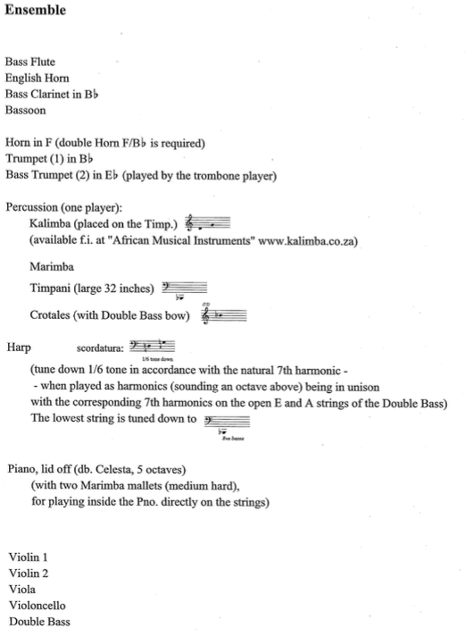

---
author: Christopher Chandler
title: Reuse and Variation in Hans Abrahamsen's *Wald*
papersize: letter
geometry: margin=1.25in
fontsize: 12pt
bibliography: "/Volumes/Data/Box\ Sync/Composition/Current\ Projects/Dissertation\ Paper/Citations/abrahamsen.bib"
csl: "/Volumes/Data/Box\ Sync/Composition/Current\ Projects/Dissertation\ Paper/Citations/chicago-note-bibliography.csl"
nocite: "[@*]"
header-includes:
    - \usepackage{setspace}
    - \doublespacing
...

# Introduction
Beginning at the age of thirty-seven between 1988 and 1998, Danish composer Hans Abrahamsen took an extended break from composing. This period of reflection, contemplation, and private work came after professional success in the late 1970s and 1980s. A precocious young composer and prominent figure of the Danish "New Simplicity" movement, he had written a confident body of work by 27. These early works like *Stratifications* (1975), *Winternacht* (1976-78), and *Walden* (1978) blended the clarity of expression and concise use of musical material associated with "New Simplicity" along with elements of neo-classicism, neo-romanticism, and collage-like polystylism. The success of these works lead to commissions from the Berlin Philharmonic^[*Nacht und Trompeten* (1981)] and the London Sinfonietta^[*Märchenbilder* (1984) and *Lied in Fall* (1987)] in the 1980s.

Yet despite these high profile commissions or perhaps due to them, Abrahamsen found it increasingly difficult to compose saying "I couldn’t find the way to make what I wanted" and that he was "paralyzed by the white paper."^[@NYT] "He felt that his music had become so complex that he no longer had the tools to create what he tried to imagine."^[@NYT] While he stopped producing new work, he did not stop working, and throughout this period, which he calls the "fermata" of his compositional life, he focused on arranging and orchestrating both other composers' works as well as his own earlier pieces. Abrahamsen arranged works by Bach, Ives, Nielsen, Nørgård, and Ravel for ensembles ranging in size from woodwind quintet to chamber orchestra. This process of revisiting other music extended to his own work, evident through different orchestrations of his woodwind quintet *Walden* and his septet *Winternacht*.

Abrahamsen emerged from this period of writer's block with his *Concerto for Piano and Orchestra* (1999-2000), which was commissioned by the BIT-20 Ensemble and composed for his wife, pianist Anne Marie Abildskov. In this four movement work, Abrahamsen draws upon musical material from his earlier pieces, most notably in the last movement where he arranges the eighth movement (*Rivière d'oubli*) of his *Ten Studies for Piano*. The *Concerto* also contains references to music by other composers through descriptive indications such as "Wie Mahler!" and "Hommage à Ligeti." **something about the piano concerto's style**

These two characteristics, returning to earlier music and referencing other composers' work, has become a hallmark of Abrahamsen's style in this "post fermata" period. *Four Pieces for Orchestra* (2004) revisits and elaborates the first four movements of *Ten Studies for Piano* and references "post-Wagnerian orchestral repertoire, from Bruckner to early Schoenberg and Anton Webern."[@FourPiecesPN] His nearly hour-long chamber work *Schnee* (2006-08) is based on the opening of Bach's *Contrapuntus I* and also references *Winternacht*. *Air* (2006) for solo accordion is a twin to *Canzone* (1978), his first work for accordion, and this material is further developed in his *String Quartet No. 3* (2008). His *Ten Sinfonias* (2010) for orchestra is an arrangement and development of his earlier *Ten Preludes* (1973) for string quartet.

Beyond these referential qualities, Abrahamsen began to incorporate new techniques in rhythm, timbre, and ensemble spatial layout into his compositional language. The *Concerto for Piano and Orchestra* features frequent changes of meter and complex polyrhythms, as well as microtonal inflections in the woodwinds and "natural" French horn. *Schnee* is scored for 9 musicians organized in a symmetrical semi-circle with three woodwinds and piano on one side, three strings and piano on the other, and a percussionist in the center. Its overall shape involves ten canons that are interspersed with three intermezzi where various combinations of the woodwinds and strings gradually detune their instruments by a quarter tone over the course of the work.

# Scope and Methodology

Abrahamsen's *Wald* (2008-09) combines all of these elements: material from an older work, references to another composer's music, complex meters, microtonal inflections, and symmetrical ensemble layout. The 18-minute work was jointly commissioned by ASKO Schönberg and the Birmingham Contemporary Music Group and is scored for a large ensemble with uncommon doublings (see Figure 1). *Wald* is a set of seven variations based on the beginning of Abrahamsen's woodwind quintet *Walden* (1978). The thematic material that appears in both pieces is a horn call of a perfect fourth that elicits responses from other instruments. The horn call repeats but has a slower periodicity than the other responses leading to a gradual change in the order. Of its connection to this earlier work and to Robert Schumann's music, Abrahamsen has said:

\singlespacing

> *Wald* is a twin piece to *Walden*, but also to my former piece *Schnee*.

> In *Walden* I borrowed the title from the American philosopher Henry David Thoreau, who, in the middle of the eighteenth century, in a little wooden hermit house at the bank of the lake Walden pond, wrote the book *Walden* of his life and time in the forests. Here he experimented living for two years in order to come closer to nature and to see if it was possible to live simply without all the unnecessary needs created by society. ... In my piece *Walden*, I tried to search for the same simplicity, handling the most simple material, but at the same time trying not to lose the poetry.

> Robert Schumann wrote in 1848-49 a wonderful piano piece, *Waldszenen*. He wrote this collection of short pieces with beautiful titles like "Einsame Blumen," "Vogel als Prophet," and also "Jäger auf der Lauer," just a few years before Thoreau wrote his book *Walden*. For them the forest is the magical romantic place that gives a spiritual insight to man, but also from where we get our food through hunting. For me the forest still has this magical quality and *Wald* has scenes with a hunting horn that calls (I many years ago played the magical "Waldhorn" and remember playing in the forest near my home), flocks of birds that when agitated take off, and there is also the sense of a hunt followed by galloping horses.[@WaldPN]

\doublespacing

*Walden* is a four-movement work for wind quintet composed in 1978 and commissioned by the Funen Wind Quintet. The title of the work comes from Henry David Thoreau's novel of the same name that documented the American philosopher's "attempt to strip away all the artificial needs imposed by society and rediscover man’s lost unity with nature."[@WaldenPN] Abrahamsen's piece reflects on this experiment and indicates in his program note:

\singlespacing

> Walden was written in a style of re-cycling and "new simplicity." A lot of superfluous material has been peeled away in order to give space to different qualities such as identity and clarity. Various layers are encountered in the quintet such as the organic (growth, flowering, decay), concretism (mechanical patterns) and finally the descriptive (distant horn calls and other ghost-like music of the past enter our consciousness like a dream).[@WaldenPN]

\doublespacing

Figure 1. *Wald* Instrumentation.

# Summary of State of Research

# Bibliography
\setlength{\parindent}{-0.4in}
\setlength{\leftskip}{0.4in}
\setlength{\parskip}{8pt}
\noindent

<!-- ^[*Wald* (2008-09)]  --> <!-- regular citation -->
<!-- [@Abrahamsen, p. 21] --> <!-- citation from bib file -->
