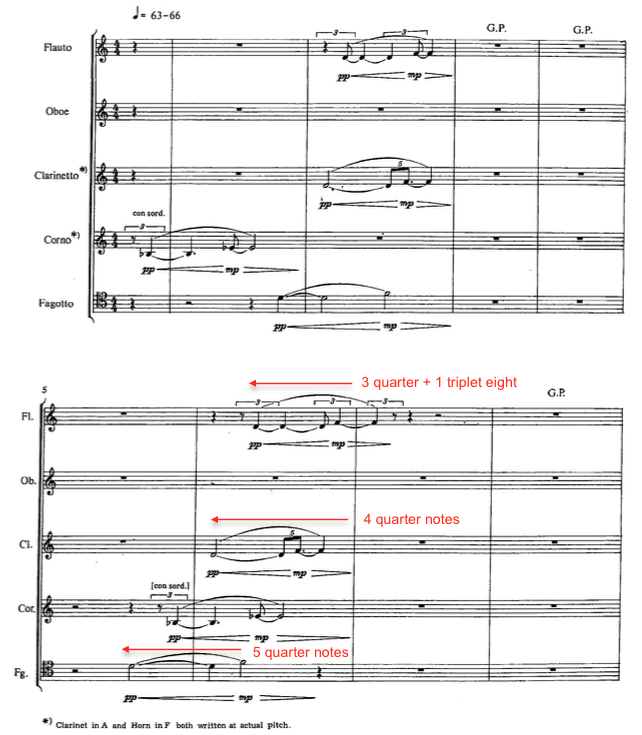
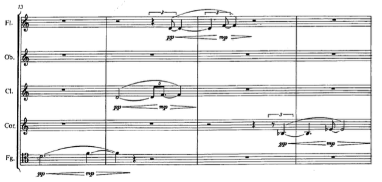

\pagenumbering{arabic}

# Introduction
Danish composer Hans Abrahamsen’s piece for large ensemble, *Wald* (2009), is a "series of variations" building on the opening of his earlier piece for woodwind quintet entitled *Walden* (1978). This return to his own music stemmed from a crisis in Abrahamsen’s compositional life, between 1991 and 1999, when he took an extended break from composing. During this time, Abrahamsen experienced debilitating writer's block; he wrote that he was "paralyzed by the white paper" and "felt that his music had become so complex that he no longer had the tools to create what he tried to imagine."[@NYT] While he slowed in producing new compositions, he did not stop working. Throughout this period, which he calls the "fermata"[@Molleson] of his compositional life, Abrahamsen found inspiration in arranging and orchestrating other composers' works as well as his own earlier pieces. This period of reflection and contemplation provided the necessary catalyst for a new stylistic period, one built upon the foundations of his first period but extended beyond it to new territory.

A precocious composer, Abrahamsen had written a well-received body of work by age 27 (1979) and he was a prominent figure associated with the Danish "New Simplicity" movement. This movement, largely a reaction against Darmstadt serialism, sought to "establish a perceptible sense of form and to evolve a new relationship with past musical styles and objects."[@Ernste, p. 8] Abrahamsen's pieces of this first period, including *Ten Preludes for String Quartet* (1973), *Stratifications* (1975), *Winternacht* (1976-78), and *Walden* (1978), blended the clarity of expression and economy of musical materials associated with "New Simplicity" along with elements of neo-classicism, neo-romanticism, and collage-like polystylism. Later first period works, like *Six Pieces* (1984) for horn, violin, and piano, and *Märchenbilder* (1984), and *Lied in Fall* (1987) show a greater sense of chromaticism and denser, more granular textures, perhaps revealing the influence of his teacher György Ligeti.

The musical style of Abrahamsen's second period is deeply informed by the groundwork he laid during the period of his "fermata." He returned to his older works and reorchestrated them for alternate ensembles, most notably the woodwind quintet *Walden* and septet *Winternacht*. He arranged and orchestrated works by Charles Ives, Carl Nielsen, Per Nørgård, and Maurice Ravel for ensembles ranging in size from woodwind quintet to chamber orchestra. Most importantly, Abrahamsen found inspiration in a set of canons by J.S. Bach^[BWV 1072-1078.] that he arranged with a distinctly Minimalist aesthetic. These canons would have a significant impact on several post-fermata works.

Abrahamsen's "fermata" ended with the *Concerto for Piano and Orchestra* (1999-2000); this piece initiated a fertile period of artistic synthesis that combined the practice of returning to previous works (and referencing other composers' works) with new innovations in compositional technique. In this second period, Abrahamsen returned to previous works in two ways: first, arrangement for larger ensembles, and second, starting from an existing germinal motive and expanding upon it significantly. For instance, Abrahamsen recasts the first four movements and eighth movement of *Ten Studies for Piano* (1984-98) for orchestral forces in *Four Pieces for Orchestra* (2004) and in the final movement of the *Piano Concerto*, respectively. *Air* (2006), for solo accordion, is a reworking and development of material from his first piece for accordion, *Canzone* (1978), and *Air* further serves as a point of departure for the *String Quartet No. 3* (2008).[@SQ3PN Program note]

Beginning with *Schnee* (2006-08) and *Wald* (2008-09), Abrahamsen's style crystalized into one based on tightly constrained musical materials, microtonal sonorities, repeating material delineated by repeat signs, frequent changes of meter, tempo modulations, and complex polyrhythms. The two works are drastically different in scope and instrumentation: *Schnee* lasts an hour and is scored for nine musicians, while *Wald* lasts eighteen minutes and is scored for fifteen musicians. Abrahamsen has nonetheless indicated that *Wald* is a "twin piece" to *Schnee*,[@WaldPN Program note] and indeed they share not only the aforementioned characteristics but also clearly articulated forms and symmetrical ensemble seating plans.

While *Schnee* has gained greater notoriety, due in part to its dramatic hour-long length, *Wald* better exemplifies the synthesis of Abrahamsen’s second period, where previous materials are recast and further developed within the context of these new compositional resources. It consists of seven variations based on the beginning of his woodwind quintet *Walden* (1978), and Abrahamsen has indicated there are additional connections to Robert Schumann's *Waldszenen*.[@WaldPN Program note] The thematic material appearing in both *Walden* and *Wald* is a rising perfect fourth horn call that elicits responses from other instruments.[@WaldPN Program note] The horn call repeats but has a slower periodicity than the other responses leading to a gradual change in the order of call and response. The passing of material around the instruments of the ensemble figures prominently throughout the work, and Abrahamsen controls this feature through the symmetrical arrangement of the ensemble into six groups. With these characteristics in mind, *Wald* represents an excellent case study to discuss the features of Abrahamsen's second period.

# Summary of the Literature
Relatively unknown outside of Europe until recently, Abrahamsen's international profile expanded significantly after the composition of *Schnee* and more recently with the Berlin Philharmonic premiere of the song cycle *let me tell you* (2014). The Cleveland Orchestra's recent American tour of this piece and its receipt of the 2016 Grawemeyer Award for Music has brought further attention to Abrahamsen in the United States.

However, little analytical work has been conducted on his music. Danish composer Karl Aage Rasmussen and scholar John David White have written books profiling Danish and Nordic composers respectively, but their discussion of Abrahamsen is limited to his earlier career, from the 1970s and 1980s.[@Rasmussen. \newline @White] Composer Kevin Ernste's dissertation on *Winternacht* (1978) represents one of the only in-depth analyses of Abrahamsen's music. Considering the existing scholarship's exclusive focus on Abrahamsen's first period, this dissertation will represent a significant and original contribution to knowledge on the music of his second period.

# Scope of the Dissertation
This dissertation has two parts: a compositional component and a research component. The compositional component is a multi-movement work for sinfonietta chamber orchestra, including flute, oboe, 2 clarinets, bassoon, French horn, trumpet, trombone, harp, piano, 2 percussionists, and string quintet. Each movement of this work will focus on different manifestations of kaleidoscope metaphors.

Kaleidoscopes are a potent guiding principle suggestive of several approaches to generating and realizing musical material, including contrapuntal activity, melodic and harmonic symmetry, and orchestration. In one movement, three archetypal gestures (arpeggiated figures, repeated-note agitated figures, and percussive articulation) will be continuously reorchestrated among different orchestral families. Juxtaposing and superimposing these gestures with specific subsets of the ensemble will not only highlight timbral qualities of the subsets but also create clearly stratified sonic objects, analogous to the colorful mosaic images produced by kaleidoscopes. In another movement, a single monophonic melody comprised of symmetrical pitch collections will be heterophonically refracted and reflected around the ensemble. The slow and morphological treatment of this material is visually akin to the fluid changes in color and shape created by rotating kaleidoscopes.

These kaleidoscopic metaphors and images are inspired in part by Abrahamsen's compositions. The ways he recasts the same or similar musical gestures within a piece, and often across a series of pieces, connects directly to my interests in exploring the inherent kaleidoscopic potential of musical ideas. It seems appropriate that both components of this dissertation engage with his music.

The research component has two goals. The principle goal is to examine the innovative compositional practices characteristic of Abrahamsen's second period through an analysis of *Wald*. The secondary goal is to examine *Wald*'s relationship to other music by Abrahamsen through the following questions: In what ways is *Wald* based on his earlier work *Walden*? How is *Wald* a "twin piece"[@WaldPN Program note] to *Schnee*? Is *Wald* related to Schumann's *Waldszenen* in any substantial way beyond poetic inspiration?

In order to conduct this analysis and address these questions, this dissertation will be divided into three parts. Part one will place Abrahamsen in a historical context by briefly discussing other twentieth-century composers who have exhibited commonalities in the two areas that define his second period: 1) a break preceding a significant change in style, and 2) a predilection for reworking earlier musical material. Part two will provide an overview of *Walden* and *Wald* in order to compare and contrast Abrahamsen's first and second period styles. Significant differences will be drawn between the two periods, and the discussion of *Walden* will largely be limited to the first movement, since it contains the majority of the common material and it has connections to the additional movements in the later work. Part three will consist of a detailed analysis of the introduction and seven variations in *Wald*. The focus will be on the ways Abrahamsen recasts the germinal material from *Walden* and develops it via harmony, orchestration (including timbral choices and the symmetrical ensemble layout), and texture (including metrical choices and polyrhythmic layering). In the following section, a brief discussion of the first movement of *Walden* and the introduction of *Wald* demonstrates the analytical methodologies to be employed in this dissertation.

# A Preliminary View of *Wald*
An analysis of *Wald* must first begin with *Walden*, as the latter provides germinal material later recast in *Wald*. Abrahamsen composed *Walden* in 1978 on a commission from the Funen Wind Quintet. The title of the four-movement work comes from Henry David Thoreau's novel of the same name that documented the American philosopher's "attempt to strip away all the artificial needs imposed by society and rediscover man’s lost unity with nature."[@WaldenPN Program note] In the program note for the piece, Abrahamsen describes the musical material and the kinds of processes that interested him:

\singlespacing

> Walden was written in a style of re-cycling and "new simplicity." A lot of superfluous material has been peeled away in order to give space to different qualities such as identity and clarity. Various layers are encountered in the quintet such as the organic (growth, flowering, decay), concretism (mechanical patterns) and finally the descriptive (distant horn calls and other ghost-like music of the past enter our consciousness like a dream).[@WaldenPN Program note]

\doublespacing

The layers of organicism, concretism, and descriptive reflect how the material unfolds in each movement. Organicism is central to the first and second movements where motives develop gradually through additive processes, for instance, melodic expansion and rhythmic augmentation and diminution. The third movement features a three-note pattern articulated heterophonically with polyrhythms (10 over 7 over 4); this bubbling texture gradually decreases in speed and gives way to slow legato oscillating patterns that compress in rhythm, ascend in register, and coalesce into an interlocking sixteenth-note texture. The description, "ghost-like music of the past," is relevant to both the horn call of the first movement as well as the contrapuntal texture in the fourth movement, which is stylistically reminiscent of Baroque music. This final movement features a composite texture of a duo of flute and bassoon in 3/4 and a trio of oboe, clarinet, and horn in 6/8.

The first movement of *Walden* begins with a call and response that Abrahamsen develops further in *Wald*. A brief examination of the process he uses to gradually unfold this material will illustrate the concept of rhythmic displacement, which is central to *Wald*. Figure @fig:walden-I-hn-theme shows the first two of four phrases separated by grand pauses in the opening of *Walden*.

{#fig:walden-I-hn-theme width=75%}

The phrases contain two motives: a single rising Bb-Eb call and three D-F echoing responses. Each instance of the motive differs slightly in rhythmic subdivision, and over the course of the four phrases, the order of the call and responses changes by rhythmic displacement each instance. Comparing the second phrase to the first, the horn enters within beat 4 as before, but the bassoon enters 5 quarter notes earlier, the clarinet 4 quarter notes, and the flute 3 quarter notes plus one triplet eighth note. This process continues through phrases three and four and ends with the horn motive isolated from the other instruments and rotated to the end (see Figure @fig:walden-I-hn-phrase4).

{#fig:walden-I-hn-phrase4 width=75%}

The simplicity and straightforward process-driven development of this material is indicative of Abrahamsen's first period compositional technique. His reworking of this material in *Wald* retains these qualities yet recasts the material with greater emphasis on timbral nuance. The form of *Wald* consists of an introduction and seven variations; the successive durations in the variations decrease over the course of the work. The listing of durations in Table 1, measured from the commercially released recording,[@WaldRec] shows that this decrease is not linear but illustrates Abrahamsen's affinity for compressing global proportions, a technique he also used in *Schnee*.

\singlespacing

Table: Sectional proportions

| Section      | Duration |
|:-------------|:---------|
| Introduction | 3:10     |
| Variation 1  | 2:38     |
| Variation 2  | 2:09     |
| Variation 3  | 2:35     |
| Variation 4  | 2:00     |
| Variation 5  | 1:39     |
| Variation 6  | 1:31     |
| Variation 7  | 1:18     |

\doublespacing

These variations are juxtaposed with little to no transitional material. Their boundaries and subsections are clearly demarcated in the score through the use of different tempi, meters, descriptive markings, and double bar lines. For instance, the Introduction, Variation 1, and Variation 2 each have four subsections with the same descriptive indications: 1) Allegro con brio, "wie aus der Ferne," 2) Poco meno ma maestoso, poco grottesco e ironico, 3) Allegro vivace e agitato, "aufgeregt," and 4) Meno mosso, soave e fluente. There are several other interrelated variations and subsections across the piece, and the entire form of the work can be grouped as shown in Figure @fig:walden-formal-groupings:

\onehalfspacing
\begin{figure}[htbp]
\begin{quote}
Part A: Introduction, Variation 1, Variation 2\\
Part B: Variation 3 and Variation 4\\
Part C: Variation 5\\
Part D: Variation 6 and Variation 7
\end{quote}
\caption{\emph{Wald} formal groupings.}\label{fig:walden-formal-groupings}
\end{figure}

\doublespacing

The introduction establishes the primary motivic and harmonic material, while variations 1 and 2 are very close re-readings of the introduction with differences in proportion, orchestration, and motivic development. These three sections, grouped as Part A, each contain four subsections differing in tempo, harmony, and activity. Variation 3 and 4 in Part B contain the quietest, calmest, and most introverted music, while Variation 5 in Part C functions as the climax, with the loudest, most chaotic, and texturally dense music. Variations 6 and 7 in Part D are harmonically related to the fourth part of Part A and contain similar harmonic material with different orchestrations.

Abrahamsen's arrangement of the 15 musicians^[Scored for: bass flute, English horn, bass clarinet, bassoon, French horn, trumpet, bass trumpet, percussion, harp, piano, 2 violins, viola, cello, and double bass.] into a semi-circle of six symmetrical groups guides his approach to orchestration. Figure @fig:wald-seating-plan shows the tree-like diagram of the seating plan and indicates the 4 groups of duos and 2 groups of trios with the piano occupying the central position outside of any group.

{#fig:wald-seating-plan width=60%}

Throughout the variations, the six groups exchange musical ideas in a way that is balanced and symmetrical: phrases performed by one group of instruments are answered by phrases from the corresponding symmetrical groups. A brief examination of the first sections of the introduction (measures 1-36) illustrates this process.

Like *Walden*, the first section of the introduction features four phrases where the rising perfect fourth motive and three echoing motives undergo rhythmic displacement. Each of the four phrases features a specific collection of instruments from Group III and Group IV (see Figure @fig:wald-seating-plan). Furthermore, each phrase repeats verbatim from the extensive use of repeat signs, characteristic of Abrahamsen's second period works. These phrases alternate lengths of 9 measures and 8 measures following an unrepeated 2 measure intro:

> \lilyTimeSignature{3}{8} 2 mm. ||: 9mm. :||: 8mm. :||: 9mm. :||: 8mm. :||

This alternating structure determines the motives that the instrumental groups perform as well as their harmonic material, which consists of only a D4-G4 dyad and a 1/6th-tone flat D4-G4. The 9-measure phrases feature the bass flute performing the rising perfect fourth motive equally tempered and colored by bisbigliando trills. The trio of instruments from Group IV (horn, bass, and harp) perform the echoing motives with the 1/6th tone flat intonation. These characteristics flip in the 8-measure phrases: the horn (seated symmetrically opposite the bass flute) performs the fourth motive with the 1/6th flat intonation while the trio of instruments in Group III (bass flute, cello, and percussion) perform equally tempered echoing motives. Unlike *Walden*, as the group exchanges material and the motivic displacement occur, the echoing motives increase in duration; for instance, the horn's repeated note gesture in the first phrase is doubled rhythmically when compared to its reappearance in phrase 3 (measure 23). Like the global form, this durational transformation is not strictly linear, but nonetheless gives an aural sensation of a ritardando.

These aspects of Abrahamsen's tight, almost obsessive, control over orchestration, harmony, form, and motivic development are evident throughout *Wald*. The piece is uniquely situated in his output as it directly follows the landmark work *Schnee* and builds upon the new techniques found there and in the *Piano Concerto*. It is a work highly representative of his second period style where materials from an earlier piece are revisited and developed in a markedly different direction, one informed by new approaches to timbre and development.

\newpage
# Bibliography
\setlength{\parindent}{-0.4in}
\setlength{\leftskip}{0.4in}
\setlength{\parskip}{7pt}
\noindent

<!-- ^[*Wald* (2008-09)]  --> <!-- regular citation -->
<!-- [@Abrahamsen, p. 21] --> <!-- citation from bib file -->
